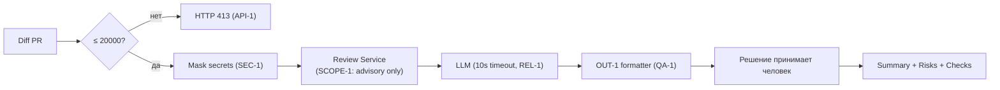

# ADR: решение для первого рабочего сценария

- Статус: proposed / accepted
- Дата: 2026-09-06
- Ответственные: SDLC Architect, команда backend

## Контекст

TRAINING_PR.diff добавляет метод `ReviewService.review(diff)` и эндпоинт `POST /api/reviews`, которые: (1) отправляют «сырой» diff во внешний LLM без редактирования секретов (app/review_service.py:20-21), (2) не ограничивают размер diff на входе API (app/api.py:35-37), (3) не управляют таймаутом внешнего вызова (REL-1), (4) возвращают неформализованный ответ `{"comment": ...}` вместо OUT-1. 
А по итогу мы должны получить AI-помошника для review с соблюдением правил из CASE.md: SEC-1, API-1, REL-1, OUT-1, SCOPE-1, QA-1, OBS-1.

## Решение

Для первого рабочего сценария:
- На входе API валидировать размер diff и возвращать HTTP 413 при `len(diff) > 20000` (API-1).
- Перед вызовом LLM применять фильтр секретов, заменяя чувствительные паттерны на `[REDACTED]` (SEC-1).
- Оборачивать вызов LLM в таймаут 10 секунд; при ошибке возвращать контролируемый OUT-1 (REL-1).
- Привести ответ к схеме OUT-1: `summary`, `risks` (≤3, каждый с `file`, `line`, `evidence`, `risk`), `checks` (OUT-1, QA-1).
- Логировать только `request_id`, длительность и статус; не логировать содержимое diff и ответа модели (OBS-1).
- Соблюдать SCOPE-1: не выполнять действий в GitHub; сервис только советует.

## Рассмотренные альтернативы

| Альтернатива | Почему не выбрали сейчас |
|---|---|
| Отложить OUT-1 и вернуть «как есть» ответ модели | Нарушение OUT-1, низкая предсказуемость для клиентов |
| Увеличить лимит diff > 20000 | Противоречит API-1 и повышает риск деградации |
| Логировать полный prompt/ответ для отладки | Нарушение OBS-1 и риск утечки секретов |

## Последствия и главный риск

- Положительные последствия:
  - Предсказуемый контракт для клиентов (OUT-1)
  - Снижение риска утечки секретов (SEC-1)
  - Контролируемые отказы при перегрузке и таймаутах (API-1, REL-1)
- Ограничения:
  - Возможны ложные срабатывания на редактирование секретов; требуется актуализация паттернов
  - Усиление валидации может отклонить редкие корректные кейсы с большими diff
- Главный риск:
  - Потеря диагностической информации из-за строгого OBS-1 и редактирования может усложнить отладку
- Как проверим риск:
  - Ввести тесты на перехват логов и обеспечить трассировку по `request_id` и длительности без содержимого; провести ручную проверку воспроизводимости по OUT-1 и evidence

## Архитектурная схема

## Как использовали AI

- Для чего: зафиксировать решение и обоснование по первому сценарию на основе TRAINING_PR.diff и правил из CASE.md
- Тип промпта: master prompt
- Строка в [`prompts.md`](prompts.md): P1-03
- Что проверили и исправили сами: уточнил и немного отформатировал контекст и сделал схему поподробнее
