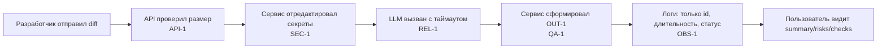

# Анализ процесса: AS IS и TO BE

## AS IS

Событие: Человек ревьюер или разработчик отправляет diff PR в сервис для быстрого анализа.

Участники: Разработчик/ревьюер, веб-API сервиса, внешний LLM.

Сервис принимает HTTP-запрос POST на эндпоинт, затем формирует prompt и отправляет его во внешний LLM.

- Точка входа: `POST /api/reviews` (TRAINING_PR.diff, app/api.py:35-37) — принимает `payload["diff"]` и напрямую вызывает `review_service.review(...)` без валидации размера (нарушение API-1).
- Бизнес-логика: `ReviewService.review(diff)` формирует prompt со «сырым» diff и вызывает `llm.generate(prompt)` (TRAINING_PR.diff, app/review_service.py:20-22). Секреты из diff не удаляются (нарушение SEC-1). Таймаут вызова и обработка ошибок не реализованы (нарушение REL-1).
- Формат ответа: API возвращает `{"comment": answer}` (TRAINING_PR.diff, app/review_service.py:22), что не соответствует контракту OUT-1. Ошибки и таймауты приводят к 500.
- Наблюдаемость: требований OBS-1 (логировать только `request_id`, длительность и статус; не логировать diff/ответ) в коде не видно. Риск утечки в логах при добавлении логирования.
- Границы помощника: SCOPE-1 соблюдается технически (код не делает merge/approve), но это не проверяется автоматически.

## TO BE

Один минимальный процесс, соответствующий CASE.md (SEC-1, API-1, REL-1, OUT-1, QA-1, OBS-1, SCOPE-1):

Ключевые изменения:
- Валидация размера diff на входе; возврат HTTP 413 при превышении 20 000 символов (API-1).
- Редактирование секретов перед формированием prompt (SEC-1).
- Таймаут внешнего вызова 10 секунд и контролируемый ответ на ошибку (REL-1).
- Приведение ответа к формату OUT-1; не более трёх `risks`, каждый с `file`, `line`, `evidence`, `risk`; добавление `checks` с воспроизводимыми шагами (OUT-1, QA-1).
- Логирование только `request_id`, `duration`, `status` без содержимого diff/ответа (OBS-1).

## Разница

| Что меняется | AS IS | TO BE | Как проверим изменение |
|---|---|---|---|
| Редакция секретов (SEC-1) | `review()` отправляет «сырой» diff в prompt (app/review_service.py:20-21) | Перед вызовом LLM секреты заменяются на `[REDACTED]` | Тест с фиктивным токеном |
| Ограничение размера (API-1) | Нет проверки в `create_review` (app/api.py:35-37) | Если `len(diff) > 20000`, вернуть HTTP 413 | Интеграционный тест с diff длиной 20001 символ |
| Таймаут и контролируемый ответ (REL-1) | Нет таймаута/обработки ошибок | Вызов LLM с таймаутом 10с; при ошибке — контролируемый ответ | тест с мок-таймаутом от LLM |
| Контракт ответа (OUT-1, QA-1) | Возвращается `{"comment": ...}` (app/review_service.py:22) | Возвращается объект: `summary`, `risks<=3` с `file,line,evidence,risk`, `checks` | E2E: проверить схему, кол-во рисков и наличие evidence из diff/правил |
| Наблюдаемость (OBS-1) | Не определена; риск логирования чувствительных данных | Логи содержат только `request_id`, `duration`, `status` | Интеграционный тест: перехват логов, убедиться в отсутствии `diff` и ответа модели |

## Как использовали AI

- Для чего: зафиксировать AS IS/TO BE процесса с привязкой к diff и правилам
- Тип промпта: master prompt
- Строка в [`prompts.md`](prompts.md): P1-03
- Что проверили и исправили сами: исправили ошибки в диаграме(теперь она рендерится), упростил текст, чтобы он был более читаемый для человека, убрал ссылки на строки, там где они не нужны
