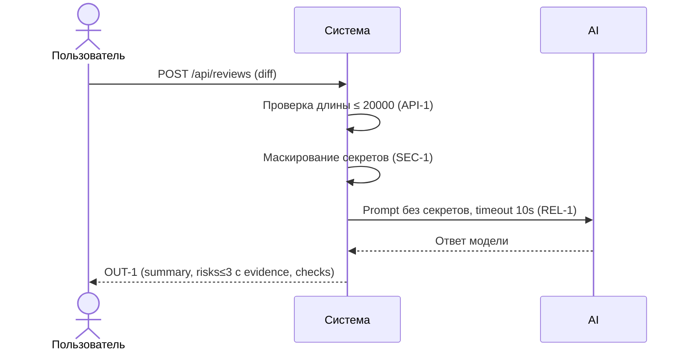

# Use cases и user stories

## Первый рабочий сценарий

**Когда** разработчик отправляет POST `/api/reviews` с `diff`, **система** проверяет размер diff (API-1), редактирует секреты в diff (SEC-1), вызывает внешний LLM с таймаутом 10 секунд (REL-1) и нормализует ответ к формату OUT-1, **а пользователь получает** объект `summary`, `risks` (≤3, с `file`, `line`, `evidence`, `risk`) и `checks`.

Не входит в этот сценарий:

- Любые автоматические действия в GitHub (merge/approve), изменение кода, UI — см. SCOPE-1 (CASE.md)

## Use case

| Поле | Значение |
|---|---|
| Актор | Разработчик/ревьюер API-клиент |
| Триггер | POST `/api/reviews` с телом `{ diff: string }` |
| Предусловия | Сервис доступен; diff не пустой |
| Основной результат | HTTP 200 с объектом OUT-1: `summary`, `risks` (≤3, с `file`, `line`, `evidence`, `risk`), `checks` |
| Ошибка или отказ | HTTP 413 при `len(diff) > 20000` (API-1); контролируемый ответ при таймауте/ошибке LLM (REL-1); ни при каких условиях сервис не делает merge/approve (SCOPE-1) |



## User stories и acceptance criteria

```gherkin
Feature: Review PR diff via API

  Scenario: Позитивный ответ в формате OUT-1
    Given доступен эндпоинт POST /api/reviews
    And корректный diff короче 20000 символов
    When я отправляю запрос с телом { "diff": "..." }
    Then я получаю HTTP 200 и JSON с полями summary, risks, checks
    And массив risks содержит не более 3 элементов
    And каждый элемент risks имеет поля file, line, evidence, risk

  Scenario: Отказ по размеру diff (API-1)
    Given доступен эндпоинт POST /api/reviews
    And diff длиной более 20000 символов
    When я отправляю запрос
    Then я получаю HTTP 413

  Scenario: Контролируемый таймаут LLM (REL-1)
    Given внешняя LLM зависает дольше 10 секунд
    When сервис вызывает LLM для данного diff
    Then сервис возвращает контролируемый ответ в формате OUT-1 без падения 500
```

## Как использовали AI

- Для чего: описать пользовательский сценарий и критерии приёмки, строго следуя CASE.md и TRAINING_PR.diff
- Тип промпта: master prompt
- Строка в [`prompts.md`](prompts.md): P1-03
- Что проверили и исправили сами: Подправил диаграмму(добавил в нее разные сценарии)
