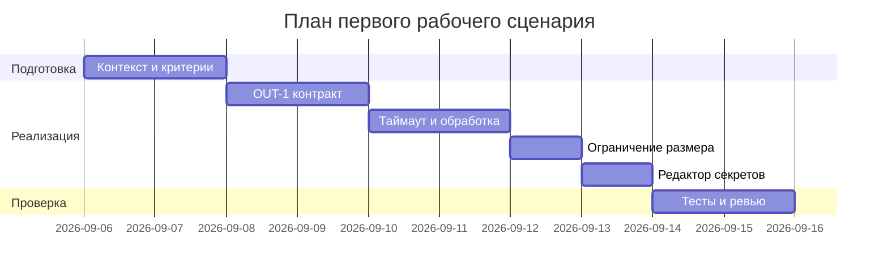

# План поставки

## Инкременты и ответственность

| Инкремент | Наблюдаемый результат | Что делает человек | Что делает AI или субагент | Проверка | Зависимости |
|---|---|---|---|---|---|
| 1 | API возвращает OUT-1 вместо {comment} | Определяет схему OUT-1; согласует формат с командой | Предлагает маппинг ответа LLM -> OUT-1, примеры | E2E тест «Позитивный OUT-1» проходит | TRAINING_PR.diff, OUT-1 (CASE.md) |
| 2 | Обработан таймаут LLM (REL-1) | Настраивает таймаут, обрабатывает исключения | Генерирует заглушки/моки LLM для таймаута | Интеграционный тест «Контролируемый таймаут» проходит | REL-1 |
| 3 | Проверка длины diff (API-1) с 413 | Добавляет валидацию на входе API | Подсказывает граничные случаи | Интеграционный тест «Отказ по размеру» проходит | API-1 |
| 4 | Редакция секретов (SEC-1) | Определяет правила редактирования | Генерирует тест-кейсы с фейковыми секретами | Unit тесты на редактирование секретов проходят | SEC-1 |
| 5 | Наблюдаемость по OBS-1 | Настраивает минимальные логи | Проверяет отсутствие содержимого diff/ответа в логах | Интеграционный тест логов проходит | OBS-1 |

## Диаграмма Ганта

Замените даты и задачи на свой план.

## Как использовали AI

- Для чего: составить минимальный инкрементальный план поставки под правила SEC-1, API-1, REL-1, OUT-1, OBS-1
- Тип промпта: master prompt
- Строка в [`prompts.md`](prompts.md): P1-03
- Что проверили и исправили сами: увязали каждый инкремент с проверкой и правилом; учли зависимость на TRAINING_PR.diff и формат OUT-1
